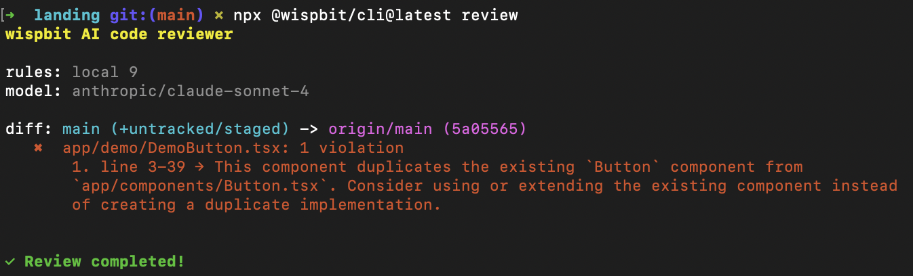

    <a href="https://wispbit.com">
        <picture>
            
        </picture>
    </a>

Keep codebase standards alive

    <a href="https://wispbit.com">
        <picture>
            
        </picture>
    </a>

---

### Why wispbit?
wispbit is a model-agnostic AI code review tool that runs anywhere and uses your rules.

wispbit works best if you struggle to keep codebase standards alive and transferring tribal knowledge feels repetitive and time consuming.

### Installation
1. `npx @wispbit/cli@latest configure`
2. `npx @wispbit/cli@latest review`

### Use cases
[See this doc (Github Actions, CI, MCP, Claude Code, Background agents)](./USE_CASES.md)

### Rules
Find examples of free and high quality rules on the [wispbit rules page](https://wispbit.com/rules) or create your own.

### FAQ
**Why not use a code editor (Cursor, Claude, Cline, etc) to review code?**
- You could totally do that, however...
- The tools and prompts for _writing_ and _reviewing_ code are different. We've tried fitting this into existing tools but we found that a specialized tool improves accuracy and reduces noise significantly.
- When everyone uses a different tool to write code, you need one central place that defines your code standards and enforces them.

**How is this different from Bugbot, Copilot, CodeRabbit, Greptile?**
- 100% open source and runs anywhere. Provider-agnostic.
- It's specific as opposed to general. Works as expected from day one vs having to fine tune the tool over time with feedback.
- You have full control of what gets reviewed and what doesn't.
- You own the data and the prompts.
- Opinionated and simple. No summaries. No poems. Just violations with actionable feedback. The goal is to get out of your way.

### Community
[Join the discord community!](https://wispbit.com/discord)
